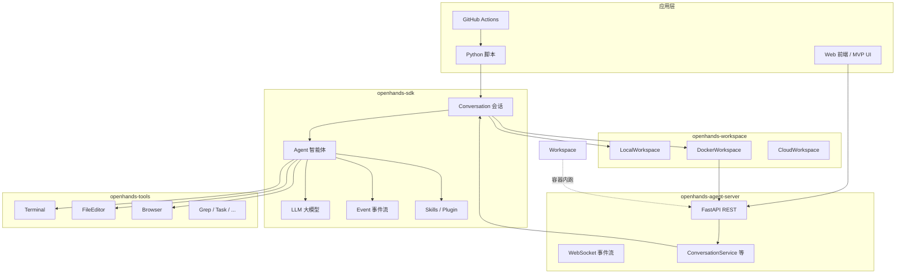
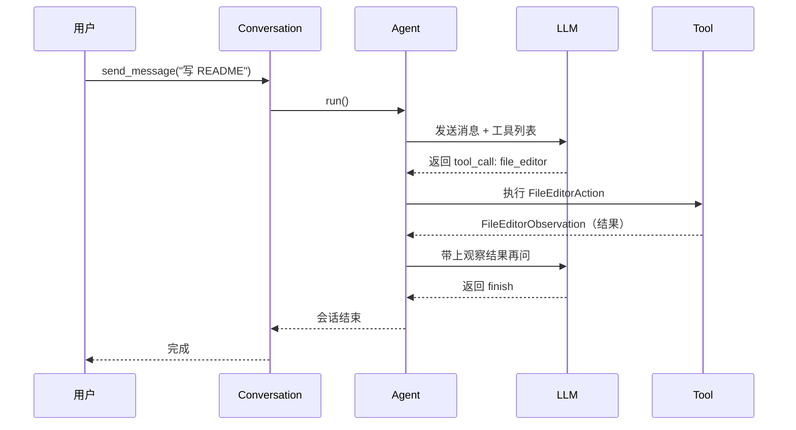
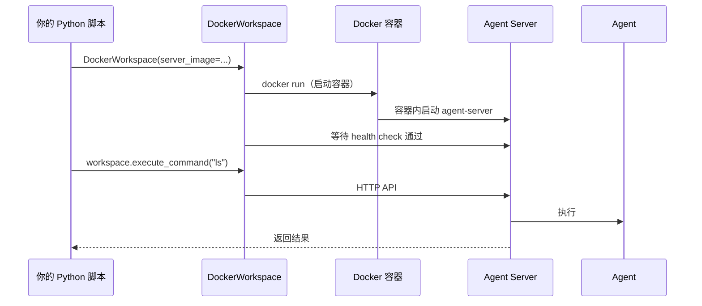
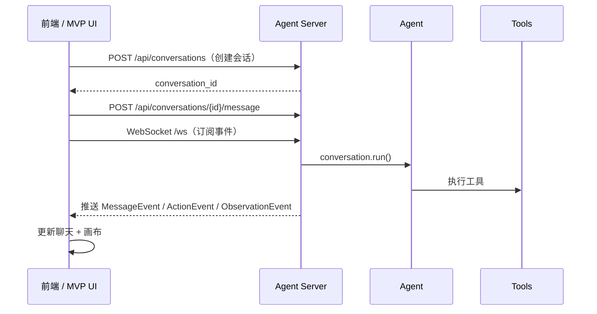
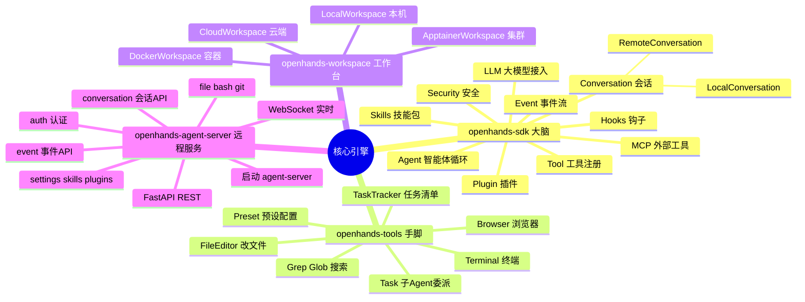

# OpenHands 核心引擎详细说明

> 本文档说明仓库中四个 Python 核心包的结构、职责与使用方法。  
> 许可：**MIT**（`enterprise/` 目录除外，本仓库未包含该目录）。  
> 配套：[官方 SDK 文档](https://docs.openhands.dev/sdk) · [MVP UI 原型](../prototype/mvp-ui/README.md)

四个 Python 包构成 OpenHands 的 **Agent 执行引擎**：

- **SDK** = 大脑（怎么想）
- **Tools** = 手脚（怎么做）
- **Workspace** = 工作台（在哪做）
- **Agent Server** = 远程服务（怎么给别人用）

---

## 一、整体架构与依赖关系



| 包名 | PyPI 包 | 依赖 | 一句话 |
|------|---------|------|--------|
| `openhands-sdk` | `openhands-sdk` | 无（根包） | Agent 核心逻辑 |
| `openhands-tools` | `openhands-tools` | sdk | 内置工具集 |
| `openhands-workspace` | `openhands-workspace` | sdk + agent-server | 隔离运行环境 |
| `openhands-agent-server` | `openhands-agent-server` | sdk | HTTP/WebSocket 服务 |

### 安装与初始化

```bash
git clone https://github.com/TinaHe1995/Agent.git
cd Agent
make build          # uv sync --dev，安装四个包 + 开发依赖
```

---

## 二、`openhands-sdk` — 大脑

> **作用：** 定义 Agent 如何思考、如何对话、如何调用大模型、如何记录每一步发生了什么。

### 2.1 核心概念

| 概念 | 含义 | 类比 |
|------|------|------|
| **LLM** | 大模型客户端（通过 LiteLLM 接入 GPT/Claude/DeepSeek 等） | 大脑皮层 |
| **Agent** | 配置了 LLM + 工具 + 提示词的智能体 | 一个会干活的员工 |
| **Conversation** | 用户与 Agent 的一次完整对话会话 | 一次项目协作 |
| **Tool** | Agent 可调用的能力（改文件、跑命令等） | 员工手里的工具 |
| **Event** | 会话中发生的每件事（消息、动作、观察结果） | 工作日志 |
| **Workspace** | Agent 操作文件/命令的环境 | 办公桌 |

### 2.2 主要子模块

| 目录 | 职责 | 关键能力 |
|------|------|----------|
| `agent/` | Agent 定义与执行循环 | 接收用户消息 → 调 LLM → 解析工具调用 → 执行 → 再调 LLM |
| `conversation/` | 会话管理 | `LocalConversation`（本机）、`RemoteConversation`（连 Server） |
| `llm/` | 大模型接入 | LiteLLM、流式输出、多模型路由、降级策略 |
| `tool/` | 工具注册与调度 | `register_tool`、`resolve_tool`、内置 finish/think |
| `event/` | 事件流 | `MessageEvent`、`ActionEvent`、`ObservationEvent` |
| `context/` | 上下文管理 | 提示词组装、**Condenser**（压缩长对话） |
| `skills/` | AgentSkills 技能包 | 从目录加载 `.md` 技能，按需注入提示词 |
| `plugin/` | 插件系统 | 从 GitHub 等来源加载扩展 |
| `subagent/` | 子 Agent | Markdown 定义多 Agent 协作 |
| `security/` | 安全分析 | 终端命令风险检测、策略拦截 |
| `hooks/` | 生命周期钩子 | 提交前检查、自定义拦截点 |
| `mcp/` | MCP 协议 | 接入外部工具服务（数据库、API 等） |
| `settings/` | 配置 Schema | Agent/会话可配置项的结构化定义 |
| `workspace/` | 工作区抽象 | `LocalWorkspace`、`RemoteWorkspace` |
| `io/` | 持久化 | 对话日志存本地文件 |
| `profiles/` | Agent 档案 | 保存/加载 Agent 配置 |

### 2.3 一次 Agent 运行的数据流



### 2.4 对外主要 API

从 `openhands.sdk` 直接导入：

```python
from openhands.sdk import (
    LLM,           # 大模型
    Agent,         # 智能体
    Conversation,  # 会话（工厂类，自动选 Local/Remote）
    Tool,          # 工具引用
    AgentContext,  # Agent 上下文（技能、插件等）
    MCPClient,     # MCP 外部工具
    Plugin,        # 插件
)
```

`Conversation` 会根据 `workspace` 类型自动选择实现：

- **LocalConversation**：在本机直接运行 Agent
- **RemoteConversation**：连接远程 Agent Server

源码位置：`openhands-sdk/openhands/sdk/conversation/conversation.py`

### 2.5 最小使用示例

```python
import os
from openhands.sdk import LLM, Agent, Conversation, Tool
from openhands.tools.file_editor import FileEditorTool
from openhands.tools.terminal import TerminalTool

llm = LLM(
    model=os.getenv("LLM_MODEL", "gpt-4o"),
    api_key=os.getenv("LLM_API_KEY"),
)

agent = Agent(
    llm=llm,
    tools=[
        Tool(name=TerminalTool.name),
        Tool(name=FileEditorTool.name),
    ],
)

conversation = Conversation(agent=agent, workspace=os.getcwd())
conversation.send_message("在当前目录创建 README.md，写 3 条项目说明")
conversation.run()
```

### 2.6 环境变量

| 变量 | 含义 |
|------|------|
| `LLM_API_KEY` | 大模型 API 密钥 |
| `LLM_MODEL` | 模型名（如 `gpt-4o`、`deepseek-chat`） |
| `LLM_BASE_URL` | 自定义 API 地址（可选） |

### 2.7 版本与依赖

- 当前版本：见 `openhands-sdk/pyproject.toml`（约 `1.29.x`）
- Python：≥ 3.12
- 关键依赖：LiteLLM、Pydantic、FastMCP、websockets

---

## 三、`openhands-tools` — 手脚

> **作用：** 提供 Agent 能实际执行的「动作」——改文件、跑终端、搜代码、开浏览器等。依赖 `openhands-sdk`，通过工具注册机制接入 Agent。

### 3.1 工具体系

每个工具通常包含三部分：

| 部分 | 文件 | 作用 |
|------|------|------|
| **Definition** | `definition.py` | 工具名、描述、参数 Schema（给 LLM 看） |
| **Action** | `definition.py` | 工具调用的输入（Pydantic 模型） |
| **Observation** | `definition.py` | 工具执行后的输出 |
| **Impl** | `impl.py` | 真正干活的逻辑 |

### 3.2 内置工具一览

| 工具 | 目录 | 能力 |
|------|------|------|
| **TerminalTool** | `terminal/` | 在 tmux 会话中执行 shell 命令 |
| **FileEditorTool** | `file_editor/` | 查看、创建、编辑文件（支持 str_replace 等） |
| **GrepTool** | `grep/` | 在项目中搜索文本 |
| **GlobTool** | `glob/` | 按 glob 模式找文件 |
| **BrowserToolSet** | `browser_use/` | 无头浏览器：打开网页、点击、截图 |
| **TaskTrackerTool** | `task_tracker/` | 维护任务清单（todo list） |
| **TaskToolSet** | `task/` | 委派子 Agent 执行子任务 |
| **ApplyPatchTool** | `apply_patch/` | 应用代码补丁（GPT-5 等模型专用） |
| **WorkflowTool** | `workflow/` | 动态工作流 |
| **DelegateTool** | `delegate/` | 委派可视化 |
| **TomConsultTool** | `tom_consult/` | 咨询专家 Agent |

### 3.3 预设配置（Preset）

`preset/` 目录提供开箱即用的 Agent 配置：

| 预设 | 文件 | 适用场景 |
|------|------|----------|
| **default** | `preset/default.py` | 标准体验：终端 + 改文件 + 任务清单 + 浏览器 |
| **planning** | `preset/planning.py` | 规划模式：先列计划再执行 |
| **gpt5** | `preset/gpt5.py` | GPT-5 专用工具集 |
| **gemini** | `preset/gemini.py` | Gemini 专用文件工具 |
| **subagents** | `preset/subagents/*.md` | 预定义子 Agent（如 code-reviewer） |

**快速获得默认 Agent：**

```python
from openhands.sdk import LLM
from openhands.tools.preset.default import get_default_agent

llm = LLM(model="gpt-4o", api_key="...")
agent = get_default_agent(llm)  # Terminal + FileEditor + TaskTracker + Browser
```

默认工具组合（`get_default_tools`）：

- `TerminalTool`
- `FileEditorTool`
- `TaskTrackerTool`
- `BrowserToolSet`（CLI 模式可关闭）

### 3.4 如何自定义工具

1. 定义 `Action` / `Observation`（Pydantic 模型）
2. 实现 `ToolDefinition` 子类
3. 用 `register_tool()` 注册
4. 在 `Agent(tools=[...])` 中引用

示例见：`examples/01_standalone_sdk/` 中的自定义工具脚本。

---

## 四、`openhands-workspace` — 工作台

> **作用：** 决定 Agent **在哪里运行**——本机目录、Docker 容器、云端沙箱等。依赖 `openhands-sdk` 和 `openhands-agent-server`（容器内会启动 Server）。

### 4.1 工作区类型

| 类 | 目录 | 场景 |
|----|------|------|
| **LocalWorkspace** | SDK 内置 | 直接在本机目录操作（最简单） |
| **DockerWorkspace** | `docker/` | 启动 Docker 容器，内含 Agent Server |
| **DockerDevWorkspace** | `docker/dev_workspace.py` | 从基础镜像现场构建开发容器 |
| **ApptainerWorkspace** | `apptainer/` | HPC / 集群的 Singularity 环境 |
| **OpenHandsCloudWorkspace** | `cloud/` | OpenHands Cloud 远程环境 |
| **APIRemoteWorkspace** | `remote_api/` | 连接已有 Agent Server 实例 |

### 4.2 DockerWorkspace 工作原理



`DockerWorkspace` 会：

1. 拉取/使用预构建镜像（如 `ghcr.io/openhands/agent-server:latest`）
2. 启动容器并在其中运行 Agent Server
3. 等待健康检查通过
4. 通过 HTTP API 提供远程工作区操作

源码位置：`openhands-workspace/openhands/workspace/docker/workspace.py`

### 4.3 使用示例

```python
from openhands.workspace.docker import DockerWorkspace

with DockerWorkspace(
    server_image="ghcr.io/openhands/agent-server:latest"
) as workspace:
    result = workspace.execute_command("ls -la")
    print(result)
```

**何时用 Docker：**

- 不信任 Agent 执行的代码（隔离沙箱）
- 需要干净、可复现的环境
- 多用户 SaaS 场景（每人一个容器）

---

## 五、`openhands-agent-server` — 远程服务

> **作用：** 把 SDK + Tools 包装成 **REST API + WebSocket**，供 Web 前端、移动 App、其他服务远程调用。是「Agent 工坊」类产品对接后端的入口。

### 5.1 技术栈

| 组件 | 技术 |
|------|------|
| Web 框架 | FastAPI |
| 异步服务器 | Uvicorn |
| 实时通信 | WebSocket |
| 持久化 | SQLite（会话元数据） |
| 终端 | libtmux |
| CLI 入口 | `agent-server` 命令 |

### 5.2 API 路由一览

| 路由模块 | 路径前缀 | 能力 |
|----------|----------|------|
| `conversation_router` | `/api/conversations` | 创建、列出、运行会话 |
| `event_router` | `/api/events` | 事件查询、WebSocket 推送 |
| `tool_router` | `/api/tools` | 工具列表与执行 |
| `file_router` | `/api/files` | 工作区文件读写 |
| `bash_router` | `/api/bash` | 终端 / Bash 会话 |
| `git_router` | `/api/git` | Git 操作 |
| `settings_router` | `/api/settings` | 配置与密钥 |
| `skills_router` | `/api/skills` | 技能管理 |
| `plugins_router` | `/api/plugins` | 插件管理 |
| `hooks_router` | `/api/hooks` | 钩子配置 |
| `mcp_router` | `/api/mcp` | MCP 服务配置 |
| `llm_router` | `/api/llm` | LLM 配置 |
| `workspace_router` | `/api/workspace` | 工作区信息 |
| `workspaces_router` | `/api/workspaces` | 多工作区管理 |
| `vscode_router` | `/api/vscode` | VS Code 集成 |
| `desktop_router` | `/api/desktop` | 远程桌面 / VNC |
| `auth_router` | `/api/auth` | API Key 认证 |
| `openai_router` | `/v1` | OpenAI 兼容 API 网关 |
| `profiles_router` | `/api/profiles` | Agent 档案 |
| `sockets_router` | `/ws` | WebSocket 连接 |

源码入口：`openhands-agent-server/openhands/agent_server/api.py`

### 5.3 启动与使用

```bash
# 初始化环境
make build

# 启动服务（默认 http://0.0.0.0:8000）
uv run agent-server

# 自定义参数
uv run agent-server --host localhost --port 3000 --reload

# 等价于
uv run python -m openhands.agent_server
```

启动后：

- **API 文档：** http://localhost:8000/docs
- **健康检查：** http://localhost:8000/alive

### 5.4 典型对接流程（Web 前端）



远程会话示例：`examples/02_remote_agent_server/01_convo_with_local_agent_server.py`

### 5.5 简易 Web UI

仓库自带一个简易聊天界面：

```bash
# 先启动 agent-server，再运行
scripts/agent_server_ui/run.sh
```

---

## 六、四包协作：三种使用模式

### 模式 A：本地脚本（最简单）

```
你 → Python 脚本 → SDK(Agent+Conversation) → Tools → 本机文件系统
```

```bash
export LLM_API_KEY="..."
uv run python examples/01_standalone_sdk/01_hello_world.py
```

**适合：** 个人自动化、一次性任务、学习体验。

### 模式 B：Docker 隔离

```
你 → Python 脚本 → DockerWorkspace → 容器内 Agent Server → Agent → Tools
```

```bash
uv run python examples/02_remote_agent_server/03_convo_with_docker_workspace.py
```

**适合：** 不信任的代码、需要沙箱、多租户 SaaS。

### 模式 C：Web 服务（产品化）

```
用户浏览器 → Agent Server API → SDK → Tools
                ↑
         MVP UI / 自研前端
```

```bash
# 终端 1
uv run agent-server

# 终端 2：测试客户端
uv run python examples/02_remote_agent_server/01_convo_with_local_agent_server.py
```

**适合：** Agent 工坊类产品、多人协作、远程 Agent。

---

## 七、与「Agent 工坊」产品的映射

| 产品能力 | 对应引擎模块 |
|----------|--------------|
| 左侧 Agent 对话 | `agent-server` 的 `conversation_router` + WebSocket |
| 右侧成果画布（文件/预览） | `file_router` + 事件流中的 Observation |
| 阶段门「待你拍板」 | `hooks_router` 或自定义 `HookConfig` |
| 技术路线 / 风格选择 | `settings_router` + 前端状态 |
| 制作进度 | WebSocket 推送 `ActionEvent` / `ObservationEvent` |
| 测试环境 / 上线 | `DockerWorkspace` + 部署脚本 |
| SaaS 多用户 | `agent-server` 多会话 + `workspaces_router` |
| BYO 大模型 Key | `llm_router` + `settings_router` |
| 技能 / 模板市场 | `skills_router` + `plugins_router` |

当前 `prototype/mvp-ui` 用 `mockAgent.ts` 模拟上述流程；产品化时需把前端改为调用 Agent Server API。

---

## 八、环境要求与常用命令

| 项目 | 要求 |
|------|------|
| Python | ≥ 3.12（仓库推荐 3.13） |
| 包管理 | `uv`（`make build` 会检查版本 ≥ 0.8.13） |
| 大模型 | `LLM_API_KEY` 环境变量 |
| Docker 工作区 | 本机安装 Docker |
| Agent Server | 无额外依赖（`make build` 即可） |

```bash
make build                    # 安装全部依赖
uv run agent-server           # 启动 API 服务
uv run pytest tests/sdk/      # 测 SDK
make build-server             # 打包 agent-server 可执行文件到 dist/
streamlit run scripts/conversation_viewer.py  # 查看对话日志
```

---

## 九、思维导图（核心引擎）



---

## 十、相关资源

| 资源 | 链接 |
|------|------|
| 官方 SDK 文档 | https://docs.openhands.dev/sdk |
| Hello World 示例 | `examples/01_standalone_sdk/01_hello_world.py` |
| 远程 Server 示例 | `examples/02_remote_agent_server/` |
| 开发指南 | `DEVELOPMENT.md` |
| MVP UI 原型 | `prototype/mvp-ui/README.md` |
| Agent 开发说明 | `AGENTS.md` |

---

## 附录：目录结构速查

```
Agent/
├── openhands-sdk/              # 大脑：Agent、对话、LLM、技能
│   └── openhands/sdk/
│       ├── agent/
│       ├── conversation/
│       ├── llm/
│       ├── tool/
│       ├── event/
│       ├── context/
│       ├── skills/
│       ├── plugin/
│       ├── security/
│       ├── hooks/
│       └── mcp/
├── openhands-tools/            # 手脚：终端、改文件、浏览器
│   └── openhands/tools/
│       ├── terminal/
│       ├── file_editor/
│       ├── browser_use/
│       ├── grep/
│       ├── glob/
│       └── preset/
├── openhands-workspace/        # 工作台：Docker、云端沙箱
│   └── openhands/workspace/
│       ├── docker/
│       ├── cloud/
│       └── apptainer/
├── openhands-agent-server/     # 远程服务：REST + WebSocket
│   └── openhands/agent_server/
│       ├── api.py
│       ├── conversation_router.py
│       ├── event_router.py
│       └── ...
├── examples/                   # 学习示例
├── tests/                      # 自动化测试
├── scripts/                    # 调试工具
└── prototype/mvp-ui/           # Agent 工坊 UI 原型
```
